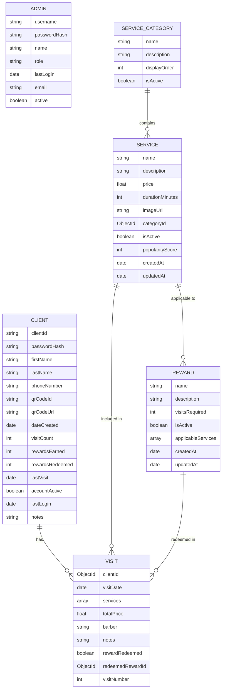

# Data Models

## Overview

The Barbaros system uses MongoDB as its database, with Mongoose as the ODM (Object Data Modeling) library. The data is organized into several collections, each represented by a Mongoose model.

## Entity Relationship Diagram

Below is a detailed entity relationship diagram showing the relationships between the different collections:



## Models

### Admin Model

The Admin model represents staff members who can access the admin dashboard.

#### Schema

```typescript
interface IAdmin extends Document {
  username: string;
  passwordHash: string;
  name: string;
  role: 'owner' | 'barber' | 'receptionist';
  lastLogin?: Date;
  email: string;
  active: boolean;
  comparePassword(candidatePassword: string): Promise<boolean>;
}
```

#### Fields

| Field         | Type     | Description                                   |
|---------------|----------|-----------------------------------------------|
| username      | String   | Unique login username                         |
| passwordHash  | String   | Securely hashed password                      |
| name          | String   | Admin's name                                  |
| role          | String   | Role (owner, barber, receptionist)            |
| lastLogin     | Date     | Timestamp of last login                       |
| email         | String   | Admin email address                           |
| active        | Boolean  | Whether admin account is active               |

#### Methods

- `comparePassword(candidatePassword: string)`: Compares a candidate password with the stored hash

### Client Model

The Client model represents customers of the barbershop.

#### Schema

```typescript
interface PreferredService {
  serviceId: mongoose.Types.ObjectId;
  count: number;
}

interface IClient extends Document {
  clientId: string;
  passwordHash: string;
  firstName: string;
  lastName: string;
  phoneNumber: string;
  qrCodeId?: string;
  qrCodeUrl?: string;
  dateCreated: Date;
  visitCount: number;
  rewardsEarned: number;
  rewardsRedeemed: number;
  lastVisit?: Date;
  accountActive: boolean;
  lastLogin?: Date;
  notes?: string;
  preferredServices: PreferredService[];
  comparePassword(candidatePassword: string): Promise<boolean>;
}
```

#### Fields

| Field            | Type     | Description                                  |
|------------------|----------|----------------------------------------------|
| clientId         | String   | Unique identifier                            |
| phoneNumber      | String   | Client phone number (for login and authentication) |
| passwordHash     | String   | Hashed password for client portal            |
| firstName        | String   | Client's first name                          |
| lastName         | String   | Client's last name                           |
| qrCodeId         | String   | Unique identifier for QR code (for scanning) |
| qrCodeUrl        | String   | API URL to retrieve the QR code image        |
| dateCreated      | Date     | When client was added to system              |
| visitCount       | Number   | Total number of visits                       |
| rewardsEarned    | Number   | Total rewards earned                         |
| rewardsRedeemed  | Number   | Total rewards redeemed                       |
| lastVisit        | Date     | Date of last visit                           |
| accountActive    | Boolean  | Whether account is active                    |
| lastLogin        | Date     | Last client login to portal                  |
| notes            | String   | Any special client preferences or notes      |
| preferredServices| Array    | Array of preferred services                  |

**qrCodeId**: Used as the unique identifier encoded in the QR code for client identification and scanning.

**qrCodeUrl**: API endpoint to retrieve the QR code image for the client (used in both admin and client dashboards).

#### Methods

- `comparePassword(candidatePassword: string)`: Compares a candidate password with the stored hash

#### Virtuals

- `fullName`: Returns the client's full name (firstName + lastName)

### Visit Model

The Visit model represents a client's visit to the barbershop.

#### Schema

```typescript
interface ServiceReceived {
  serviceId: mongoose.Types.ObjectId;
  name: string;
  price: number;
  duration: number;
}

interface IVisit extends Document {
  clientId: mongoose.Types.ObjectId;
  visitDate: Date;
  services: ServiceReceived[];
  totalPrice: number;
  barber: string;
  notes?: string;
  rewardRedeemed: boolean;
  redeemedRewardId?: mongoose.Types.ObjectId;
  visitNumber: number;
}
```

#### Fields

| Field           | Type     | Description                                  |
|-----------------|----------|----------------------------------------------|
| clientId        | ObjectId | Reference to client                          |
| visitDate       | Date     | Date and time of visit                       |
| services        | Array    | Array of services received                   |
| totalPrice      | Number   | Total price for all services                 |
| barber          | String   | Name of barber who provided service          |
| notes           | String   | Notes about this specific visit              |
| rewardRedeemed  | Boolean  | Whether a reward was used for this visit     |
| redeemedRewardId| ObjectId | Reference to the redeemed reward             |
| visitNumber     | Number   | Which visit number this is for the client    |

### Service Model

The Service model represents services offered by the barbershop with enhanced features for image storage, categorization, and popularity tracking.

#### Schema

```typescript
interface IService extends Document {
  name: string;
  description: string;
  price: number;
  durationMinutes: number;
  imageUrl?: string;
  categoryId: mongoose.Types.ObjectId;
  isActive: boolean;
  popularityScore: number;
  createdAt: Date;
  updatedAt: Date;
}
```

#### Fields

| Field           | Type     | Description                                  |
|-----------------|----------|----------------------------------------------|
| name            | String   | Name of service (required, trimmed)         |
| description     | String   | Description of the service (required)       |
| price           | Number   | Regular price (required, minimum: 0)        |
| durationMinutes | Number   | Typical duration in minutes (required, min: 1)|
| imageUrl        | String   | Base64 image data stored in MongoDB         |
| categoryId      | ObjectId | Reference to service category (required)     |
| isActive        | Boolean  | Whether the service is currently offered (default: true)|
| popularityScore | Number   | Calculated score based on selection frequency (default: 0)|
| createdAt       | Date     | When service was added (auto-generated)     |
| updatedAt       | Date     | When service was last updated (auto-generated)|

#### Features

- **Image Storage**: Images are stored as base64 data directly in MongoDB for simplified deployment
- **Search Capability**: Full-text search on name and description fields
- **Category Integration**: Linked to service categories with populate support
- **Popularity Tracking**: Score increases with each service selection for analytics
- **Status Management**: Active/inactive toggle for easy service management
- **Price Validation**: Supports decimal pricing with minimum value validation
- **Duration Management**: Flexible duration setting in minutes

#### Indexes

- `categoryId`: Index for category-based queries and filtering
- `popularityScore`: Descending index for sorting by popularity
- `isActive`: Index for filtering active/inactive services

### ServiceCategory Model

The ServiceCategory model represents categories of services with display ordering and status management.

#### Schema

```typescript
interface IServiceCategory extends Document {
  name: string;
  description: string;
  displayOrder: number;
  isActive: boolean;
  createdAt: Date;
  updatedAt: Date;
}
```

#### Fields

| Field        | Type     | Description                                  |
|--------------|----------|----------------------------------------------|
| name         | String   | Category name (required, unique, trimmed)   |
| description  | String   | Category description (required)              |
| displayOrder | Number   | Order to display categories in (default: 0) |
| isActive     | Boolean  | Whether category is active (default: true)  |
| createdAt    | Date     | When category was created (auto-generated)  |
| updatedAt    | Date     | When category was last updated (auto-generated)|

#### Features

- **Display Ordering**: Custom sort order for category presentation
- **Status Management**: Active/inactive toggle for category visibility
- **Unique Names**: Enforced unique category names to prevent duplicates
- **Search Capability**: Search on name and description fields
- **Service Relationship**: One-to-many relationship with services

#### Indexes

- `displayOrder`: Index for sorting by display order
- `name`: Unique index for enforcing unique category names

### Reward Model

The Reward model represents loyalty rewards that clients can earn.

#### Schema

```typescript
interface IReward extends Document {
  name: string;
  description: string;
  visitsRequired: number;
  isActive: boolean;
  applicableServices: mongoose.Types.ObjectId[];
  createdAt: Date;
  updatedAt: Date;
}
```

#### Fields

| Field             | Type     | Description                                  |
|-------------------|----------|----------------------------------------------|
| name              | String   | Name of reward                               |
| description       | String   | Description of what the reward includes      |
| visitsRequired    | Number   | Visits needed to earn this reward            |
| isActive          | Boolean  | Whether the reward is currently offered      |
| applicableServices| Array    | Services this reward can be applied to       |
| createdAt         | Date     | When reward was created                      |
| updatedAt         | Date     | When reward was last updated                 |

## Indexes

Database indexes are implemented for optimal query performance:

### Client Collection Indexes
- `firstName, lastName, phoneNumber, clientId`: Text search index for full-text search
- `phoneNumber, isActive`: Compound index for phone lookup with status filtering
- `clientId`: Unique index for client ID lookup
- `lastName, firstName`: Compound index for name-based sorting and search
- `createdAt`: Descending index for recently created clients
- `isActive, createdAt`: Compound index for active clients by creation date

### Visit Collection Indexes
- `clientId, visitDate`: Compound index for client visit history (descending date)
- `visitDate`: Descending index for date-based analytics queries
- `barber, visitDate`: Compound index for barber performance analytics
- `createdAt`: Descending index for recent visits
- `clientId, createdAt`: Compound index for client timeline queries

### Service Collection Indexes
- `categoryId`: Index for category-based queries and filtering
- `popularityScore`: Descending index for sorting by popularity
- `isActive`: Index for filtering active/inactive services

### BarberAchievement Collection Indexes
- `barberId, month, year`: Compound index for monthly barber statistics
- `totalVisits`: Descending index for leaderboard sorting by visit count
- `month, year, totalVisits`: Compound index for monthly leaderboards with performance sorting

### ServiceCategory Collection Indexes
- `displayOrder`: Index for sorting by display order
- `name`: Unique index for enforcing unique category names

### Performance Considerations

All indexes are created with the following optimizations:

1. **Background Creation**: Indexes are created with `background: true` to prevent blocking operations
2. **Named Indexes**: All indexes have descriptive names for better maintenance
3. **Compound Index Order**: Field order in compound indexes follows query patterns
4. **Selective Indexing**: Only frequently queried fields are indexed to balance performance and storage

```javascript
// Example index creation
ClientSchema.index(
  { firstName: 'text', lastName: 'text', phoneNumber: 'text', clientId: 'text' },
  { background: true, name: 'client_text_search' }
);

ClientSchema.index(
  { phoneNumber: 1, isActive: 1 },
  { background: true, name: 'phone_active_lookup' }
);

VisitSchema.index(
  { clientId: 1, visitDate: -1 },
  { background: true, name: 'client_visit_history' }
);
```

### Query Performance Guidelines

1. **Use Covered Queries**: Ensure queries can be satisfied entirely by index data
2. **Avoid Regex on Large Collections**: Use text search indexes instead of regex for text searches
3. **Limit Result Sets**: Always use `.limit()` for pagination
4. **Sort by Indexed Fields**: Ensure sort operations use indexed fields
5. **Monitor Query Performance**: Use MongoDB's explain() to analyze query performance

## Data Validation

All models include validation rules to ensure data integrity:

- Required fields are enforced
- String fields have appropriate trimming
- Numeric fields have minimum values where appropriate
- Password fields are hashed before saving
- References between collections are properly typed

## Next Steps

For information on the API utilities that interact with these models, see the [API Endpoints](./api-endpoints.md) documentation. 